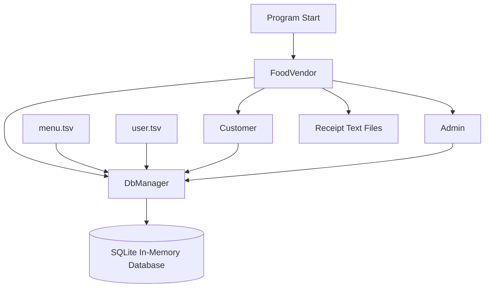
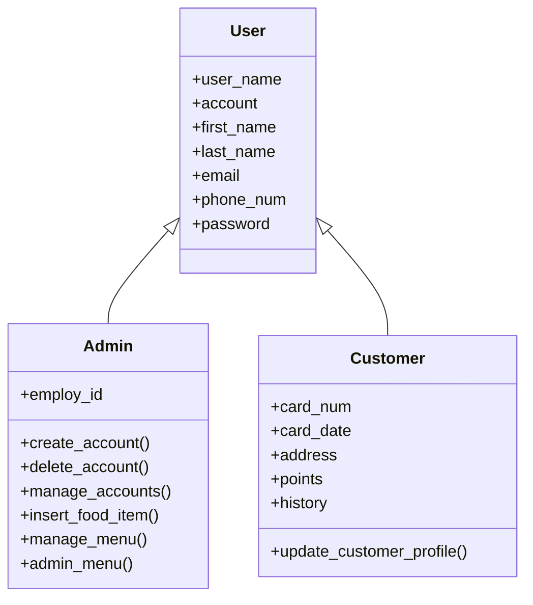
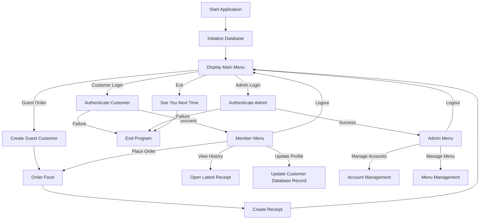
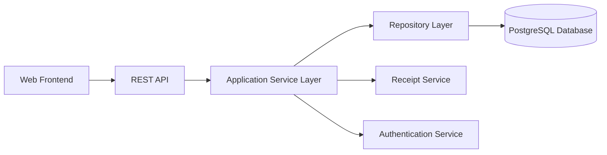

# Application Architecture

## Overview

The Food Vendor Management System is a command-line Python application built using object-oriented programming and a layered class structure.

The application separates responsibilities across three primary modules:

- `FoodVendor.py` controls the application flow, authentication, ordering, receipt generation, and user-facing menus.
- `Users.py` defines the user hierarchy and user-specific behaviors.
- `DbManager.py` manages all SQLite database operations.

The application also uses tab-separated value files to populate its menu and user tables when the program starts.

---

## Architectural Goals

The project was structured to support the following goals:

- Separate database logic from user-interface logic
- Reuse shared user attributes through inheritance
- Support customer, guest, and administrator workflows
- Centralize application navigation in the `FoodVendor` class
- Encapsulate SQL operations inside a dedicated database-management class
- Make individual methods testable in isolation
- Support incremental development and integration testing

---

## High-Level Architecture



The `FoodVendor` object coordinates the primary workflow.

The `DbManager` object owns the database connection and performs SQL operations.

`Customer` and `Admin` objects represent the two authenticated account types and contain behavior related to their respective roles.

---

## Core Classes

## `FoodVendor`

The `FoodVendor` class acts as the primary application controller.

### Responsibilities

- Initialize the database
- Display the main menu
- Authenticate customers
- Authenticate administrators
- Route users to the appropriate menu
- Process food orders
- Generate receipts
- Display order history
- Manage receipt numbers
- Coordinate interactions between user objects and the database

### Important attributes

| Attribute | Purpose |
|---|---|
| `db` | Stores the active `DbManager` instance |
| `receipt_number` | Tracks the next receipt number, beginning at `1000` |

### Important methods

| Method | Responsibility |
|---|---|
| `initialize()` | Connects to SQLite and loads initial menu and user data |
| `main_menu()` | Displays the top-level application menu |
| `admin_login()` | Authenticates administrator accounts |
| `customer_login()` | Authenticates customer accounts |
| `member_menu()` | Displays customer account options |
| `order_food()` | Manages menu selection and checkout |
| `create_receipt()` | Calculates order totals and creates a receipt file |
| `print_order_history()` | Opens and displays the customer's most recent receipt |

---

## `User`

The `User` class is the base class for both `Admin` and `Customer`.

### Shared attributes

- Username
- Account type
- First name
- Last name
- Email address
- Phone number
- Password

Using inheritance prevents these shared attributes from being duplicated across the two user types.



---

## `Admin`

The `Admin` class extends `User`.

### Additional attribute

| Attribute | Purpose |
|---|---|
| `employ_id` | Stores the administrator's employee identifier |

### Responsibilities

- Update administrator profile information
- Create customer or administrator accounts
- Delete user accounts
- Manage customer profiles
- Insert new food items
- Update menu prices
- Update menu descriptions
- Update menu availability
- Navigate administrator menus

The `Admin` class does not execute SQL directly. Instead, it calls methods provided by `DbManager`.

---

## `Customer`

The `Customer` class extends `User`.

### Additional attributes

| Attribute | Purpose |
|---|---|
| `card_num` | Stores the customer's credit-card number |
| `card_date` | Stores the credit-card expiration date |
| `address` | Stores the billing address |
| `points` | Stores available reward points |
| `history` | Stores the receipt number of the most recent order |

### Responsibilities

- Store payment and billing information
- Track reward points
- Track the customer's latest receipt
- Update customer profile information
- Provide a formatted string representation for receipts

The default `Customer` constructor is also used to create guest users.

---

## `DbManager`

The `DbManager` class is responsible for all database access.

### Responsibilities

- Open and close the SQLite connection
- Create database tables
- Import menu and user data
- Insert records
- Retrieve records
- Update records
- Delete records
- Validate users and menu items
- Retrieve food prices and preparation times
- Display available menu items

Centralizing SQL inside `DbManager` keeps database logic out of the user and application-controller classes.

### Database connection

The project uses an in-memory SQLite database:

```python
sqlite3.connect(":memory:")
```

This means the database exists only while the application is running.

At startup, `menu.tsv` and `user.tsv` are loaded into the SQLite tables.

---

## Application Flow



---

## Ordering Flow

The ordering process follows these steps:

1. Create an empty order list.
2. Display food categories.
3. Allow the user to choose a category.
4. Display available items for that category.
5. Validate the selected item.
6. Add the item to the order.
7. Display side options when applicable.
8. Repeat until the user checks out.
9. Collect guest payment information or member reward-point information.
10. Calculate subtotal, discounts, total cost, and wait time.
11. Generate a receipt.
12. Update reward points and order history for registered customers.

---

## Receipt Generation

Receipt files are generated using the format:

```text
FoodVendorReceipt1001.txt
FoodVendorReceipt1002.txt
FoodVendorReceipt1003.txt
```

The receipt-generation process combines data from:

- The current `Customer` object
- The order-item list
- Menu prices from the database
- Preparation times from the database
- Reward points selected for redemption

For registered customers, the process also updates:

- Reward-point balance
- Latest order-history receipt number

---

## Dependency Flow

The primary dependencies are:

```text
FoodVendor
├── DbManager
├── Customer
└── Admin

Admin
└── DbManager

Customer
└── DbManager

DbManager
├── Admin
└── Customer
```

`DbManager` returns fully constructed `Admin` and `Customer` objects when retrieving users from the database.

Because several classes depend on the same active database connection, database ownership and object initialization were important architectural concerns during development.

---

## Testing Architecture

The project was tested at multiple levels.

### Method-level testing

Individual methods were tested in isolation, including:

- Database connection
- Table creation
- User insertion
- Menu insertion
- Price updates
- Profile updates
- Receipt creation
- Login behavior

### Integration testing

Integrated workflows were tested across multiple classes, including:

- `member_menu()` calling `order_food()`
- `order_food()` calling `create_receipt()`
- `create_receipt()` updating the customer and database
- `admin_menu()` calling `manage_menu()`
- `manage_menu()` updating SQLite records
- The full `__main__` application loop

### End-to-end testing

The complete application was run through:

- Guest checkout
- Customer login and logout
- Member ordering
- Administrator login and logout
- Main-menu return behavior
- Clean application shutdown

---

## Architectural Limitations

The current architecture has several intentional limitations:

- The database is not persistent.
- The interface is command-line based.
- Passwords are stored as plain text.
- Database dependencies are passed inconsistently in some inherited milestone methods.
- The application does not use a formal service or repository layer.
- Receipt history stores only the most recent receipt number.
- The application is single-user and single-process.

These limitations reflect the project's educational scope rather than production design.

---

## Future Architecture

A future full-stack version could use:



Potential architectural upgrades include:

- Browser-based frontend
- REST API
- Persistent PostgreSQL database
- Secure authentication
- Password hashing
- Session management
- Dependency injection
- Repository pattern
- Automated test framework
- Containerized deployment
- Cloud hosting
