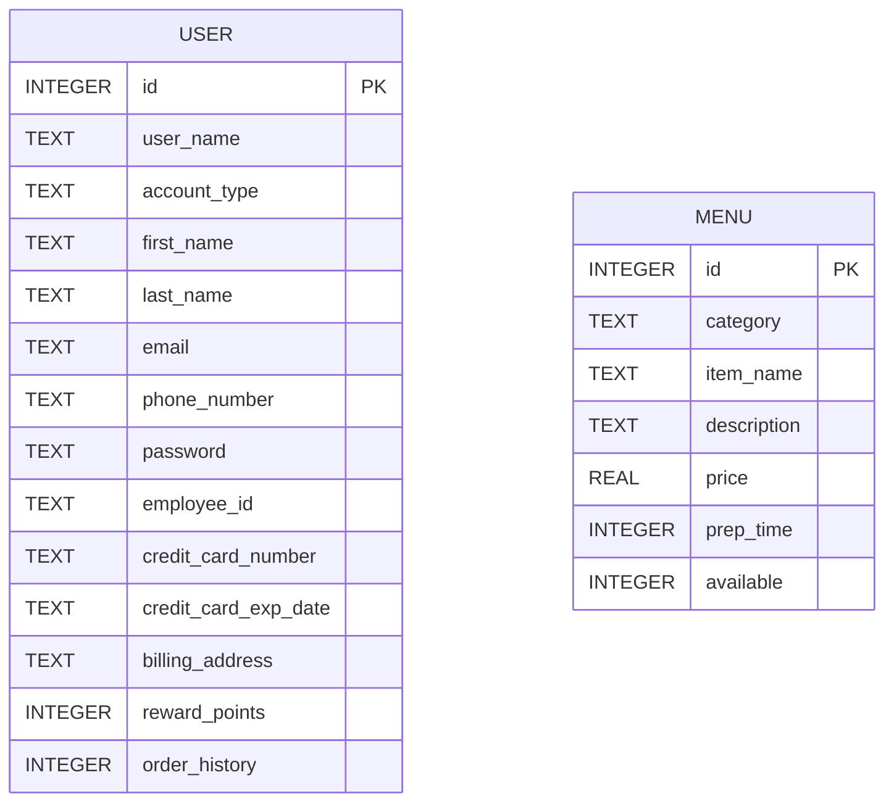
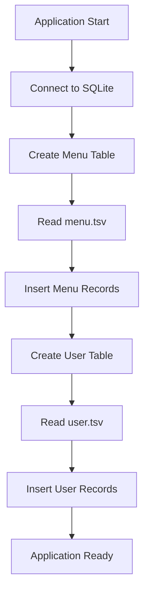
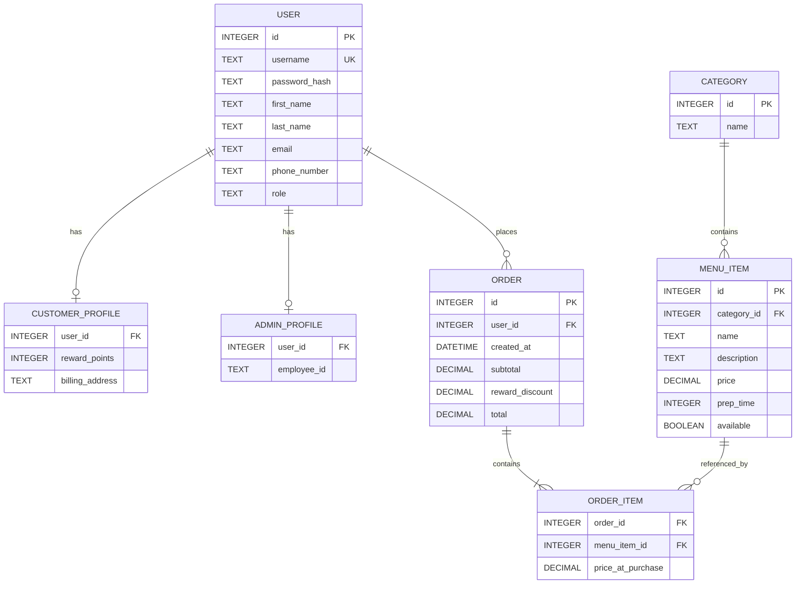

# Database Schema

## Overview

The Food Vendor Management System uses SQLite to store user-account and menu information.

The database is created in memory when the application starts:

```python
sqlite3.connect(":memory:")
```

Because the database is in memory, all stored data is removed when the program terminates.

Initial records are loaded from two tab-separated value files:

- `menu.tsv`
- `user.tsv`

---

## Schema Diagram



The current version does not define a direct foreign-key relationship between the two tables.

The `order_history` field stores the receipt number associated with a customer's most recent order.

---

# User Table

The `user` table stores both administrator and customer accounts.

Account type is determined by the `account_type` column.

## Definition

```sql
CREATE TABLE IF NOT EXISTS user (
    id INTEGER PRIMARY KEY,
    user_name TEXT,
    account_type TEXT,
    first_name TEXT,
    last_name TEXT,
    email TEXT,
    phone_number TEXT,
    password TEXT,
    employee_id TEXT,
    credit_card_number TEXT,
    credit_card_exp_date TEXT,
    billing_address TEXT,
    reward_points INTEGER,
    order_history INTEGER
);
```

---

## User Table Columns

| Column | Type | Description |
|---|---|---|
| `id` | INTEGER | Primary key automatically generated by SQLite |
| `user_name` | TEXT | Unique account username used during login |
| `account_type` | TEXT | Identifies the account as `admin` or `customer` |
| `first_name` | TEXT | User's first name |
| `last_name` | TEXT | User's last name |
| `email` | TEXT | User's email address |
| `phone_number` | TEXT | User's phone number |
| `password` | TEXT | Account password |
| `employee_id` | TEXT | Employee identifier for administrator accounts |
| `credit_card_number` | TEXT | Payment-card number for customer accounts |
| `credit_card_exp_date` | TEXT | Credit-card expiration date |
| `billing_address` | TEXT | Customer billing address |
| `reward_points` | INTEGER | Customer reward-point balance |
| `order_history` | INTEGER | Receipt number of the customer's most recent order |

---

## User Record Types

The table uses a single-table inheritance approach.

### Administrator records

Administrator records typically include:

- `account_type = "admin"`
- Employee ID
- Empty customer payment fields
- No meaningful reward-point or order-history data

### Customer records

Customer records typically include:

- `account_type = "customer"`
- Credit-card information
- Billing address
- Reward points
- Order-history receipt number
- Empty employee ID

---

## Example Administrator Record

```text
admin	admin	afirst	alast	admin@email.com	1234567890	password	FV1001				0	0
```

## Example Customer Record

```text
customer	customer	first	last	customer@email.com	1234567890	password		1111222233334444	1028	123 Test Street	55	1001
```

---

# Menu Table

The `menu` table stores food items that can be displayed and ordered.

## Definition

```sql
CREATE TABLE IF NOT EXISTS menu (
    id INTEGER PRIMARY KEY,
    category TEXT,
    item_name TEXT,
    description TEXT,
    price REAL,
    prep_time INTEGER,
    available INTEGER
);
```

---

## Menu Table Columns

| Column | Type | Description |
|---|---|---|
| `id` | INTEGER | Primary key automatically generated by SQLite |
| `category` | TEXT | Food category or side-option category |
| `item_name` | TEXT | Display name of the food item |
| `description` | TEXT | Description shown on the daily menu |
| `price` | REAL | Item price |
| `prep_time` | INTEGER | Estimated preparation time in minutes |
| `available` | INTEGER | Availability flag: `1` for available, `0` for unavailable |

---

## Menu Categories

The application uses categories such as:

- `Sandwiches`
- `Salads`
- `Drinks`
- `Mexican food`
- `Vegetarian`

Side-option categories use an `_option` suffix:

- `Sandwiches_option`
- `Salads_option`
- `Vegetarian_option`
- `Mexican_option`

Drinks do not use side-option categories.

---

## Example Menu Record

```text
Salads	Cajun	Cajun salad and dressing	16.70	8	1
```

This represents:

| Field | Value |
|---|---|
| Category | Salads |
| Item name | Cajun |
| Description | Cajun salad and dressing |
| Price | 16.70 |
| Preparation time | 8 minutes |
| Available | Yes |

---

# Data Loading

When the application starts, the database manager performs the following steps:

1. Opens an in-memory SQLite connection.
2. Creates the `menu` table.
3. Reads `menu.tsv`.
4. Converts price, preparation-time, and availability values to numeric types.
5. Inserts each menu record.
6. Creates the `user` table.
7. Reads `user.tsv`.
8. Converts reward points and order history to integers.
9. Inserts each user record.



---

# CRUD Operations

## Create

### User creation

New user accounts are inserted using:

```python
insert_user(user)
```

The method uses a parameterized SQL statement containing 13 values.

### Menu-item creation

New food items are inserted using:

```python
insert_menu(menu)
```

The inserted tuple contains:

```text
category
item_name
description
price
prep_time
available
```

---

## Read

### User queries

The database supports:

- Checking whether a username exists
- Retrieving administrator accounts
- Retrieving customer accounts

Relevant methods include:

```python
is_user_exist()
get_admin()
get_customer()
```

### Menu queries

The database supports:

- Displaying daily menu items
- Retrieving item prices
- Retrieving preparation times
- Checking whether an item exists
- Checking whether an item is available

Relevant methods include:

```python
display_daily_menu()
get_food_price()
get_food_time()
is_food_exist()
is_food_available()
```

---

## Update

### User updates

The system can update:

- Administrator phone number
- Administrator email address
- Customer credit-card number
- Customer expiration date
- Customer billing address
- Customer phone number
- Customer email address
- Customer reward points
- Customer order history

Relevant methods include:

```python
update_admin()
update_customer()
update_customer_rewards()
update_customer_history()
```

### Menu updates

The system can update:

- Item price
- Item category
- Item description
- Item availability
- Item name

Relevant methods include:

```python
set_food_price()
set_food_category()
set_food_description()
set_food_availability()
set_food_name()
```

---

## Delete

User accounts can be removed using:

```python
delete_user(user_name)
```

The SQL operation deletes records where `user_name` matches the provided value.

---

# Parameterized Queries

The project uses parameterized SQL statements rather than inserting user-provided values directly into SQL strings.

Example:

```python
cursor.execute(
    """
    UPDATE user
    SET reward_points = ?
    WHERE user_name = ?
    """,
    (value, name)
)
```

This approach:

- Separates SQL syntax from data
- Reduces formatting errors
- Improves code readability
- Helps protect against SQL injection

---

# Data-Type Decisions

## Phone numbers

Phone numbers are stored as `TEXT` rather than integers.

This preserves:

- Leading zeros
- Exact formatting
- Values that are identifiers rather than mathematical quantities

## Credit-card numbers

Credit-card numbers are stored as `TEXT`.

They are identifiers and may exceed normal integer limits in other environments.

## Expiration dates

Expiration dates are stored as `TEXT` to preserve values such as:

```text
0728
```

## Availability

Availability is stored as an integer:

```text
1 = available
0 = unavailable
```

## Price

Prices are stored as `REAL`.

For a production financial application, fixed-point decimal storage would be preferable.

---

# Current Schema Limitations

The educational schema has several limitations:

- `user_name` is not formally declared `UNIQUE`.
- Passwords are stored as plain text.
- Credit-card numbers are stored directly.
- There is no dedicated order table.
- There is no order-item junction table.
- Only the most recent receipt number is stored.
- There are no foreign-key constraints.
- Menu categories are stored as free-form text.
- The in-memory database does not persist.
- Customer and administrator data share one table with several nullable fields.

---

# Recommended Production Schema

A production-ready redesign could include:



This redesign would support:

- Persistent order history
- Multiple orders per customer
- Normalized user roles
- Better security
- Referential integrity
- Reporting and analytics
- Web and API integration
